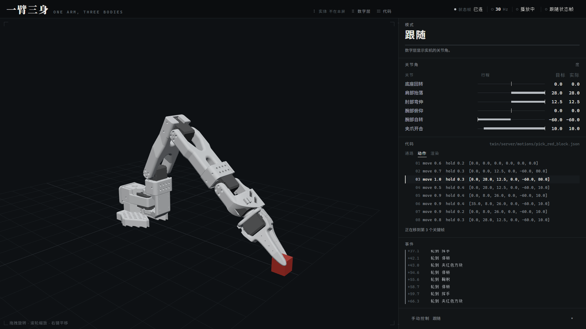

# 数字层 · Digital Layer

课程项目「一臂三身」里屏幕那一侧。装置由三层组成：真实机械臂（SO-ARM101）＋屏幕左半的数字层（3D 数字孪生）＋屏幕右半的代码面板。

这个仓库只有**数字层**：一个 Python 后端按 30 Hz 广播六个关节角，一个零构建的浏览器前端把它渲染成随动的机械臂，并把这条数据通路本身显示在屏幕右半。硬件侧（真机运动、遥操、VLA 部署）不在这里。

## 快速开始

需要 **Python 3.12+** 和 **Node 22+**（Node 只在跑自检与探测脚本时用到，它们依赖 Node 内置的 `WebSocket`）。前端零构建，不需要 npm。

```bash
git clone <repo> && cd <repo>

python -m venv .venv
source .venv/bin/activate          # Windows: .venv\Scripts\activate
pip install -r twin/requirements.txt

python twin/tools/fetch_assets.py  # 第一次必跑：拉 three / urdf-loader / SO-101 的 URDF 与 STL
python twin/server/main.py         # 起服务
```

浏览器打开 `http://127.0.0.1:8000/`。

`fetch_assets.py` 是**唯一需要外网的一步**。它同时做四层校验：文件存在与大小、vendor 的 import 闭包完整、URDF 能解析、URDF 引用的网格都在。缺什么直接报出来，不会等到页面白屏才发现。

### 常用开关

```bash
python twin/server/main.py --http-port 8080 --ws-port 8081   # 换端口
python twin/server/main.py --no-record                       # 不写 JSONL 留档
python twin/server/main.py --quiet                           # 不每 5 秒打一行进度
python twin/tools/serve.py                                   # 纯静态服务，页面停在零位
python twin/server/library.py --check                        # 只校验三个动作文件，不起服务
```

页面参数：`?panel=0` 不要手动控制抽屉，`?plate=0|1|2` 钉住代码层里的某一块，`?diag=1` 左下角打印实时状态，`?ws=0` 不连后端只看静态模型。

## 开源来源

本项目的形态不是从零设计的，几个关键结构来自上游：

| 用途 | 来源 | 说明 |
|---|---|---|
| 3D 渲染 | [three.js](https://github.com/mrdoob/three.js) `r186` | MIT |
| URDF 解析 | [urdf-loader](https://github.com/gkjohnson/urdf-loader) `0.13.1` | Apache-2.0 |
| 机器人模型 | [TheRobotStudio/SO-ARM100](https://github.com/TheRobotStudio/SO-ARM100) 的 `Simulation/SO101/` | URDF 与 STL，许可以上游为准 |
| 关节命名与量纲 | [LeRobot](https://github.com/huggingface/lerobot) | 六个关节名与 `use_degrees=True` 的顺序照它来 |

两个前端依赖**故意不用 CDN**，以本地文件形式放在 `web/vendor/`。演示现场在教室，网络不可靠，这是整个项目唯一对外网有依赖的地方，用本地副本把它摘掉。版本与文件清单见 [`web/vendor/SOURCES.md`](web/vendor/SOURCES.md)。

## 目录

```
requirements.txt      Python 侧依赖（只有 websockets）
server/               后端
  main.py             入口：装配各环、起两个 listener、按 30Hz 推进
  config.py           可调参数集中一处（端口、频率、动作顺序）
  protocol.py         状态帧打包/解包。与 web/src/frame.js 是一对，改一边必须改另一边
  library.py          动作库：加载、按时间采样、--check 校验
  sources.py          数据源。MotionLibrarySource（当前）/ RealSerialSource（接实机时）
  pipeline.py         播放时钟、零位标定、模式调度
  broadcast.py        状态帧广播、上行控制、JSONL 留档
  static.py           静态文件服务，tools/serve.py 与它共用这一份
  motions/            三个动作的关键帧 JSON
web/                  静态根，后端直接 serve 这个目录
  index.html          importmap + 页面骨架
  src/                全部前端代码，零构建。console.js 是屏幕右半，code-plates.js 是它显示的内容
  vendor/             第三方依赖本地副本（脚本下载，不入库）
  models/so101/       官方 URDF 与 13 个 STL（同上）
tools/
  cdp.mjs             无头 Chrome + CDP 的共用部分
  fetch_assets.py     下载 + 校验资产
  serve.py            纯前端开发用的静态服务器
  selftest.mjs        端到端自检
  probe.mjs           对着活页面跑一段 JS，量数据用
run/                  JSONL 留档，只保留最近 5 个（--no-record 可关）
```

## 当前实现的功能



屏幕分左右两半，中间一道竖线。**左半 · 数字层**是机械臂的像：相机自动取景，可拖拽旋转、滚轮缩放、右键平移，手臂按后端发来的 30 Hz 状态帧做指数插值跟过去；场景里那个红色方块，夹爪合拢到能罩住它就会跟着走。

**右半 · 代码层。** 四段：**模式**（跟随 / 反向 / 无关运动，带过渡进度）、**关节角**（六个关节的目标角与实际角，各配一条按限位归一化的行程尺）、**代码轮转**、**事件**。代码轮转在三块之间每 14 秒换一次——数据通路、当前动作的真实关键帧、前端渲染循环——高亮那一行由真实状态决定（暂停、模式、目标与实际的差、视图状态），不是定时器在跑。点标题钉住某一块。

**三个动作循环。** 机械臂自己循环做三个动作：挥手 → 夹红色方块 → 鞠躬，动作之间停 1 秒。动作是手编关键帧（`server/motions/*.json`），改完重启后端即可。

**手动调节。** 代码层最下面是一个收起来的抽屉，展开后是六个关节滑块，拖动能直接摆姿态。拖动即接管——状态帧不再写关节值，按「回到跟随」退出。抽屉里还有三个按钮：**暂停**（冻结后端的播放时钟，不是断开连接）、**记录姿态**（把当前六关节角追加到 `server/motions/_draft.json`）、**回零位**。暂停和接管是两件正交的事：前者管「后端播不播」，后者管「本地谁写关节值」。
